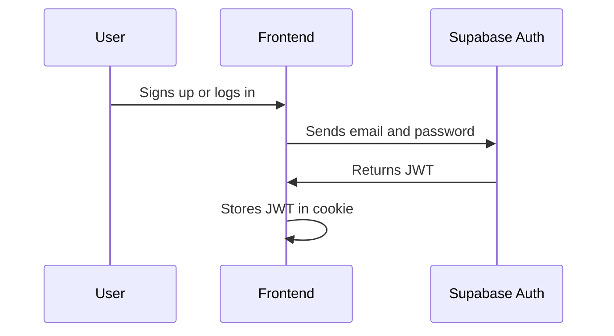
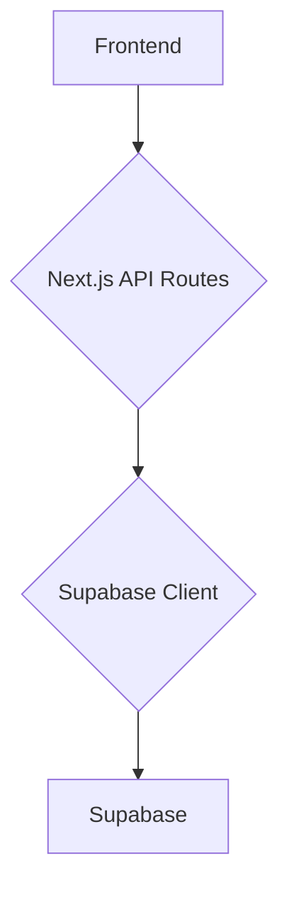

# Architecture Documentation

This document outlines the architecture of the Telopillo.com project, a web application built with Next.js and Supabase.

## Overview

The project follows a component-based architecture, with a clear separation of concerns between the frontend, backend, and database. The frontend is built with React and Next.js, the backend is powered by Supabase, and the database is PostgreSQL.

## Directory Structure

The directory structure is organized as follows:

-   `/app`: Contains the main application logic, including pages, layouts, and components.
-   `/components`: Contains reusable UI components.
-   `/lib`: Contains shared libraries and utility functions.
-   `/supabase`: Contains Supabase-related files, including migrations and functions.
-   `/tests`: Contains Playwright tests.

## Frontend Architecture

The frontend is built with Next.js, a React framework for building server-rendered applications. The UI is composed of reusable components, which are organized by feature in the `/components` directory. The main application logic is located in the `/app` directory, which contains the pages, layouts, and API routes.

### Authentication

Authentication is handled by Supabase Auth, which provides a secure and easy-to-use authentication solution. The authentication flow is as follows:

1.  The user signs up or logs in using their email and password.
2.  Supabase Auth creates a new user and returns a JWT.
3.  The JWT is stored in a cookie and sent with every request to the backend.
4.  The backend verifies the JWT and authorizes the user to access protected resources.

## Backend Architecture

The backend is powered by Supabase, a backend-as-a-service platform that provides a suite of tools for building modern web applications. The backend is responsible for handling API requests, interacting with the database, and managing user authentication.

### API Routes

The API routes are located in the `/app/api` directory and are implemented as Next.js API routes. These routes are responsible for handling requests from the frontend and interacting with the Supabase backend.

### Database

The database is a PostgreSQL database hosted on Supabase. The database schema is managed with Supabase Migrations, which allows for version-controlled database changes.

## Testing

The project uses Playwright for end-to-end testing. The tests are located in the `/tests` directory and are run with the `npm run test:e2e` command. The tests cover the main user flows, including authentication, product creation, and search.

## Deployment

The project is deployed on Vercel, a cloud platform for static sites and serverless functions. The deployment process is automated with GitHub Actions, which builds and deples the application to Vercel on every push to the `main` branch.
