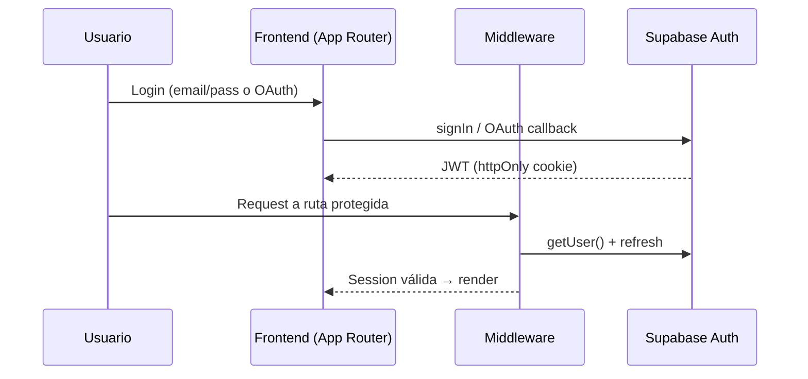
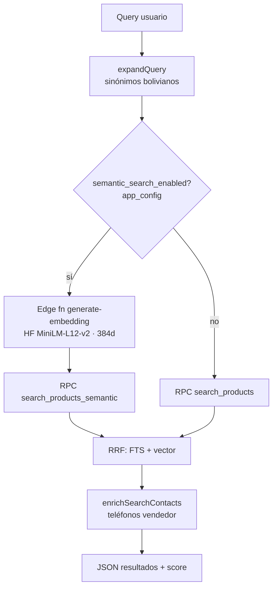

# Architecture — Telopillo

Documento canónico de arquitectura. Refleja el estado real del código (M4.7 completado, M5+ pendiente). Para detalle por feature, ver los `ARCHITECTURE.md` de cada milestone bajo `milestones/`. Para **deep-dives** (modelo de datos, RLS, decisiones) ver [`architecture/`](./architecture/README.md).

> Última revisión: julio 2026. Idioma: documentación en español, código en inglés (`CLAUDE.md`).

## 1. Visión general

Marketplace boliviano (compradores ↔ vendedores). Diferenciador: **búsqueda semántica híbrida** que entiende español boliviano, sinónimos y typos.

- **Frontend:** Next.js 16.1.6 (App Router), React 19, TypeScript (strict), Tailwind CSS v4, shadcn/ui (Radix).
- **Backend:** Supabase — PostgreSQL 15 + Auth + Storage + Realtime + Edge Functions (Deno) + **pgvector**.
- **Mutaciones:** Server Actions (no API routes). **Lecturas públicas:** API routes + Supabase Client anónimo.
- **Deploy:** Vercel (frontend) + Supabase Cloud (backend). **CI:** Husky pre-commit (`lint-staged`). No hay GitHub Actions.

### Estado actual
Completado: M0–M4.7 (auth, productos, búsqueda híbrida, perfiles de negocio, share links, demand-side "Busco"). Pendiente: M5 chat realtime, M6 favoritos/ratings, M7+ (ver `milestones/README.md`). Backlog de bugs abierto: `status/BUG_AUDIT_2026-05-29.md`.

## 2. Estructura de directorios

```
app/            Páginas App Router, layouts, api/ (rutas públicas), route groups (auth)/(static)
components/     UI por feature: auth, products, demand, profile, business, search,
                layout, network, onboarding, providers, shared, ui/ (shadcn)
lib/            actions/ (server actions), supabase/ (clients), validations/ (Zod),
                search/ (synonyms + contactos), offline/ (resiliencia), network/ (fetch),
                utils/, data/, constants/
types/          database.ts — schema TS de la DB (generado)
supabase/       migrations/ (24 SQL), functions/ (Edge Functions), config.toml
tests/          e2e/ (Playwright, por journey) + unit/ (node:test)
```

## 3. Capa de datos y clientes Supabase (`lib/supabase/`)

Tres clientes según contexto. **Crítico:** elegir el correcto por operación.

| Cliente | Uso | RLS |
|---------|-----|-----|
| `createClient()` (server.ts) | Server Components / Server Actions / API authd. Cookies httpOnly vía `@supabase/ssr`. | Sí, respeta `auth.uid()` |
| `createPublicClient()` (server.ts) | Lecturas anónimas (búsqueda pública). Sin cookies. | Sí, sólo policies públicas |
| `createClient()` (client.ts) | Browser. | Sí |
| `createAdminClient()` (admin.ts) | Service role — **bypassa RLS**. Sólo backend con justificación (embeddings, jobs). | No |

### Server Actions = capa de mutación
`lib/actions/{auth,products,demand,profile,business-profile}.ts` con wrapper `result.ts`. Toda escritura de usuario pasa por aquí con validación Zod server-side + `stripHtml()`. **No** se escribe directo al Supabase desde el cliente (ver TELO-004 en bug audit — migración en curso).

### Base de datos
- **Tablas:** `profiles`, `business_profiles`, `products`, `demand_posts`, `demand_offers`, `app_config`.
- **RLS habilitado en todas** con policies `auth.uid() = user_id`. Storage con paths user-scoped `{userId}/*`.
- **Buckets:** `avatars`, `product-images`, `demand-images` (5MB, JPEG/PNG/WebP, compresión client-side en `lib/utils/image.ts`).
- Schema tipado en `types/database.ts`.

## 4. Autenticación

Supabase Auth: **email/password + Google OAuth + Facebook OAuth**. JWT en cookies httpOnly. `middleware.ts` (+ `lib/supabase/middleware.ts`) refresca sesión en cada request y protege rutas: `/profile`, `/perfil`, `/publicar`, `/mensajes`, `/busco/publicar`, `/productos/[id]/editar`.


```mermaid
sequenceDiagram
    participant U as Usuario
    participant F as Frontend (App Router)
    participant M as Middleware
    participant S as Supabase Auth
    U->>F: Login (email/pass o OAuth)
    F->>S: signIn / OAuth callback
    S-->>F: JWT (httpOnly cookie)
    U->>M: Request a ruta protegida
    M->>S: getUser() + refresh
    M-->>F: Session válida → render
```

Dev bypass: `DISABLE_AUTH=true` (server-only, **nunca en producción**; middleware lo rechaza si `NODE_ENV=production`).

## 5. Búsqueda semántica híbrida (núcleo del producto)

Flujo público, sin auth. Combina Full-Text Search (Postgres) + búsqueda vectorial (pgvector) con **Reciprocal Rank Fusion (RRF)**.


```mermaid
graph TD
    Q[Query usuario] --> EXP[expandQuery<br/>sinónimos bolivianos]
    EXP --> FLAG{semantic_search_enabled?<br/>app_config}
    FLAG -->|sí| EMB[Edge fn generate-embedding<br/>HF MiniLM-L12-v2 · 384d]
    EMB --> SEM[RPC search_products_semantic]
    FLAG -->|no| KW[RPC search_products]
    SEM --> RRF[RRF: FTS + vector]
    KW --> RRF
    RRF --> ENR[enrichSearchContacts<br/>teléfonos vendedor]
    ENR --> R[JSON resultados + score]
```

- **API:** `GET /api/search` (público). Fallback graceful: si falla el embedding → cae a keyword-only.
- **FTS:** `to_tsvector` / `plainto_tsquery`. **Vectorial:** pgvector, índice **HNSW** (`vector_cosine_ops`).
- **RPCs:** `search_products` (keyword) y `search_products_semantic` (híbrido, RRF interno). Demanda usa `/api/search-demands` + `search_demands`.
- **Embeddings:** Edge Function `generate-embedding` (Deno) vía Hugging Face Inference API. Modos: webhook de producto (INSERT/UPDATE), query, backfill, demand post. Cache en memoria 5 min.

## 6. Resiliencia

`lib/network/fetch.ts` — `fetchWithPolicy` con timeout + reintentos. `lib/offline/`: borradores (`drafts`), caché de lectura (`read-cache`), caché de búsqueda (`search-cache`), recuperación de subidas (`upload-recovery`).

## 7. Testing

- **E2E:** Playwright, organizado por journey en `tests/e2e/` (auth, buyer-journey, seller-journey, demand-side, search-discovery, cross-cutting). Scripts `test:{e2e,buyer,seller,demand,search,a11y,mobile}`.
- **Unit:** `node:test` en `tests/unit/` (`test:unit`).
- **Accesibilidad:** `@axe-core/playwright`. Meta: WCAG 2.2 AA.

## 8. Deploy y CI

- **Frontend:** Vercel. **Backend:** Supabase Cloud. Migrations vía `npx supabase db push`; Edge Functions vía `npx supabase functions deploy`.
- **CI local (pre-commit, Husky + lint-staged):** ESLint + Prettier + `normalize-next-env`. Type-check vía `npm run type-check`.
- **No hay GitHub Actions** (a la fecha). Deploy de Vercel dispara por integración git, no por workflow de Actions.

## 9. Contexto boliviano

UI en español (dialecto boliviano). Search entiende sinónimos locales (ej. "chompa" = "sudadera"). Moneda BOB (Bs. 1.234,56). Departamentos oficiales. NIT = tax ID (PII sensible).
